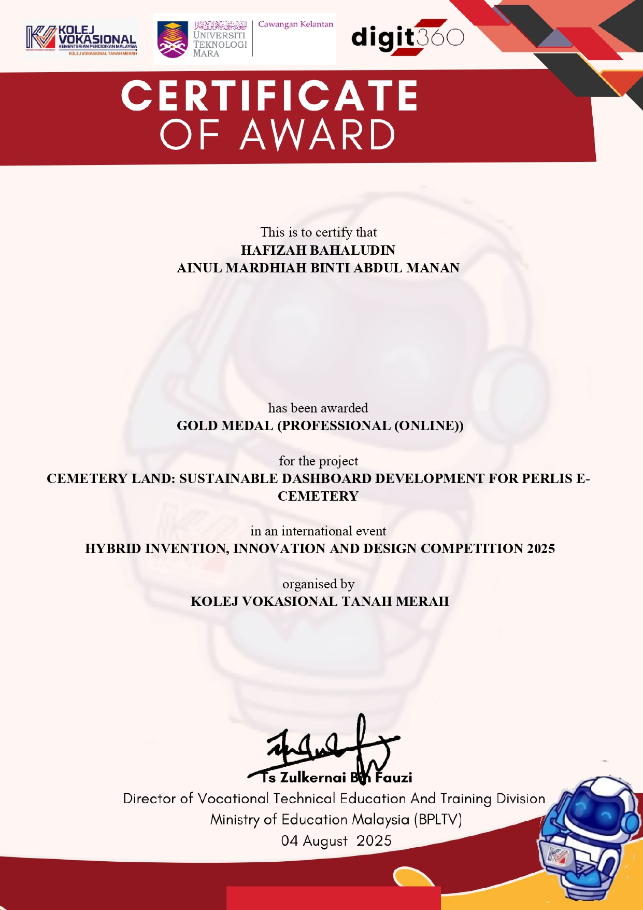
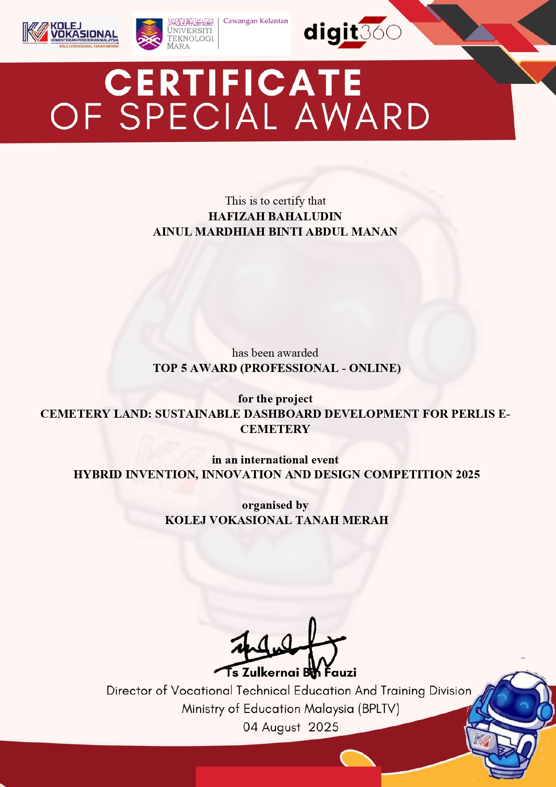

# Analyzing Projections of Cemetery Land Utilization: A Case Study of Perlis State
>Watch video presentation [here](https://www.youtube.com/watch?app=desktop&v=ATx0IS33_es)

## About e-Cemetery Project
During my internship, I was actively involved in the development of the Perlis e-cemetery project under JAIPs (Perlis State Islamic Religious Affairs Department). My main contribution focused on analyzing historical and demographic data and digitalizing the traditional cemetery management using an interactive dashboard to assist JAIPs in making informed decisions regarding future cemetery land planning.

## Key Contribution
- **Digitalizing a traditional cemetery records** using an interactive **dashboard**, ensuring the insights were accessible for decision-makers at JAIPs.
- Conducted data analysis using historical demographic data to **forecast the annual demand for cemetery land**.

## Tools
- **Python**: For data cleaning & processing.
- **Microsoft Excel**: Forecasting long-term cemetery land requirements.
- **Google Looker Studio**: For visualizing the analysis results through a dynamic and user-friendly dashboard, enhancing clarity and supporting informed decision-making.

## Dashboard Overview

## Publication
- **Title**: [Analyzing Projections of Cemetery Land Utilization: A Case Study of Perlis State](chrome-extension://efaidnbmnnnibpcajpcglclefindmkaj/https://persama.org.my/images/Menemui_Matematik/2025/MMv473_8_20.pdf)
- **Publisher**: Menemui Matematik (Discovering Mathematics)
- **Date**: 12 December 2025
- **Place of publication**: [Malaysian Mathematical Sciences Society](https://persama.org.my/dismath/home)

## Achievement
- **Competition**: International Invention, Innovation and Design Competition (i3dc) 2025
- **Organizer**: Tanah Merah Vocational College
- **Category**: Professional Online
- **Award**: Gold Medal, Top 5 Award and Diamond Award

## Certificates
### Gold Medal
  
### Top 5 Award
  
### Diamond Award
  

  
